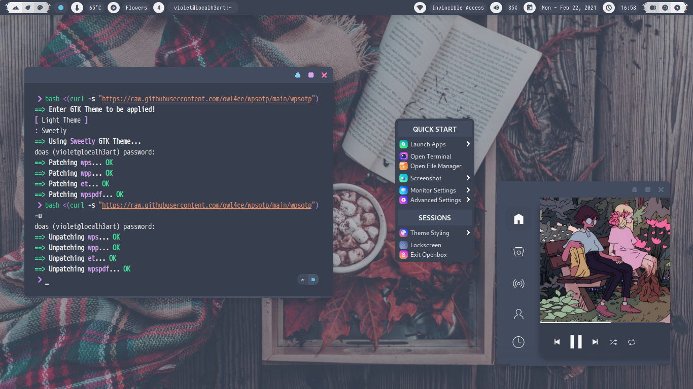
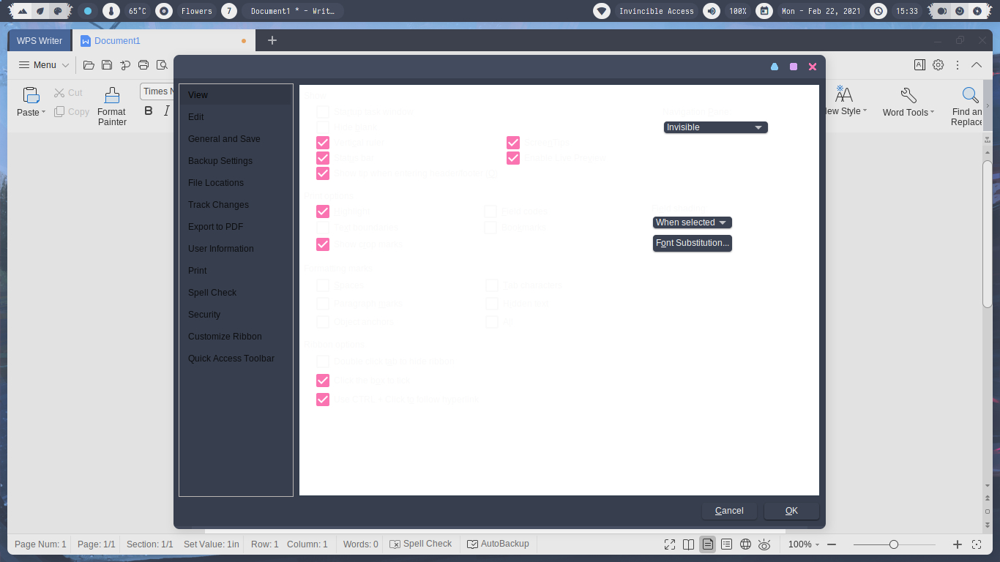
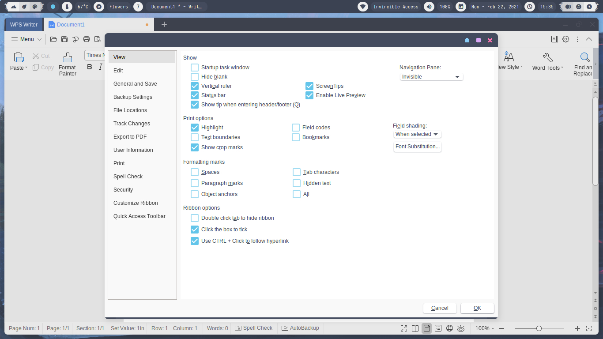

<h2 align="center">WPS Office Theme Patcher</h2>

<p align="center">Easily patch WPS Office Themes to solve QT problems on Dark GTK Themes on GNU/Linux</p>

##  
### Dependencies 
`bash` `sed` `sudo/doas` `wps-office`

##  
### Patching
cURL/wget **wpsotp** then enter your Light GTK Themes e.g **Adwaita**.
```bash
$ bash <(curl -s "https://raw.githubusercontent.com/owl4ce/wpsotp/main/wpsotp")
```

> :heavy_check_mark: **WPS 2019**

##  
### Undo Patch
```bash
$ bash <(curl -s "https://raw.githubusercontent.com/owl4ce/wpsotp/main/wpsotp") -u
```

##  
### Re-patch
Just undo patch and patch again.

##  

<p align="center"></p>

Dark GTK Themes|Light GTK Themes
|--|--|
|

##  
### Credits
- *https://tan.my.id/post/fix-dark-theme-wps*
